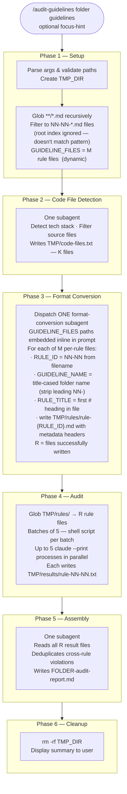

# Simplify audit-guidelines for Per-Rule Directory Structure

> **For Claude:** REQUIRED SUB-SKILL: Use superpowers:executing-plans to implement this plan task-by-task.

**Goal:** Rewrite the `audit-guidelines` skill to exclusively support the current guideline layout: one `.md` file per rule, rules organized in section subfolders under a root directory, with an optional root index file that is ignored. Remove the now-dead rule-splitting Discovery phase entirely.

**Architecture:** Phase 1 globs the guidelines directory recursively and keeps only `NN-NN-*.md` files (one per rule); the number of sections and files is discovered at runtime, not hardcoded. Phase 3 becomes a single format-conversion subagent that adds metadata headers to each file — no splitting, no branching. Phases 4–6 are unchanged.

**Tech Stack:** Markdown skill file at `/home/node/.claude/skills/audit-guidelines/SKILL.md`.

---

## Background: What the New Structure Looks Like and Why the Skill Breaks

### Guideline structure

```
docs/coding-guidelines/
├── CODING_GUIDELINES.md             ← optional root index; ignored by the skill
├── 01-core-architecture/            ← any number of section folders, any names
│   ├── 01-01-static-classes.md      ← starts with: # 01-01. Static Classes for Pure Logic
│   ├── 01-02-explicit-parameters.md
│   └── …  (any number of rule files)
├── 02-delegates-and-dependency-wiring/
│   └── …
└── …
```

- Each rule file is named `NN-NN-*.md` and starts with `# NN-NN. Rule Title`
- `GUIDELINE_NAME` is derived from the parent folder name at runtime — not hardcoded
- The root index file (if present) is filtered out automatically by the `NN-NN-*.md` pattern
- The number of sections and rules is discovered dynamically each run

### What the current skill does wrong

| Phase | Problem | Root cause |
|-------|---------|------------|
| **Phase 1 (Setup)** | `glob *.md` finds only the root index file — misses all rule files in subfolders | Glob does not recurse into subfolders |
| **Phase 3 (Discovery)** | Looks for `### NN-NN` headings — finds zero in per-rule files (which use `# NN-NN.`) — writes nothing to `tmp/rules/` | Pattern mismatch; also derives `GUIDELINE_NAME` from filename instead of parent folder |

### What changes

Phase 3 (Discovery) existed entirely to *split* multi-rule section files into individual rule files. With one rule per file there is nothing to split — only trivial reformatting (add 4 metadata header lines). The entire Discovery subagent approach is replaced by a single format-conversion subagent. The per-section code path is deleted, not branched around.

---

## Task 1: Rewrite Phase 1 — Setup, Invocation, and Process Overview

**File:** `/home/node/.claude/skills/audit-guidelines/SKILL.md`
**Sections:** `## Invocation`, `## Process Overview`, `## Phase 0: Setup (Inline)`

### Step 1: Fix `<guidelines-path>` description in Invocation

In the `## Invocation` section, find:

```
- `<guidelines-path>`: Directory of `.md` files OR single index `.md` with links to guideline documents
```

Replace with:

```
- `<guidelines-path>`: Absolute path to a directory containing per-rule guideline files in section subfolders (files named `NN-NN-*.md`)
```

### Step 2: Fix Process Overview step 3

In the `## Process Overview` numbered list, find:

```
3. **Discovery** — one Task subagent per guideline file extracts rules into individual files in `tmp/rules/`
```

Replace with:

```
3. **Format Conversion** — one Task subagent adds metadata headers to per-rule files, writing them to `tmp/rules/`
```

### Step 3: Add Process Overview step 6

After step 5 in the Process Overview list:

```
5. **Assembly** — one Task subagent reads all result files, builds and writes the final report
```

Insert immediately after:

```
6. **Cleanup** — delete tmp folder (inline, no subagent)
```

### Step 4: Rename the Setup section heading

Change:
```
## Phase 0: Setup (Inline)
```
to:
```
## Phase 1: Setup (Inline)
```

### Step 5: Read the current "If directory" bullet

Locate step 3. The bullet currently reads:

```
**If directory:** Glob `*.md`, sort alphabetically → ordered list of absolute paths
```

### Step 6: Replace it

```
**If directory:** Recursively glob `**/*.md`; keep only files whose filename matches `NN-NN-*.md` (two digits, hyphen, two digits, hyphen, any name — e.g. `01-01-static-classes.md`); sort alphabetically. This filtered list is `GUIDELINE_FILES`. If the glob returns zero matching files, error immediately: `"No rule files found in {GUIDELINES_PATH}. Expected files named NN-NN-*.md inside section subfolders."`.
```

### Step 7: Delete the "If index file" and "If index file yields zero paths" bullets

The skill no longer supports passing an index file as `GUIDELINES_PATH`. Remove both bullets entirely. The `GUIDELINES_PATH` argument is now always a directory.

### Step 8: Fix Phase 1 step 8 display message

In step 8 of Phase 1, find:

```
8. Display: `"Found M guideline files. Detecting tech stack and filtering code files..."`
```

Replace with:

```
8. Display: `"Found M rule files. Detecting tech stack and filtering code files..."`
```

### Step 9: Verify

Re-read the Invocation, Process Overview, and Phase 1 sections. Confirm:
- `<guidelines-path>` description says "directory containing per-rule guideline files" — no mention of index files
- Process Overview step 3 says "Format Conversion", not "Discovery"
- Process Overview has 6 numbered steps matching all 6 phase headings
- Phase 1 step 3 has only the "If directory" bullet — the "If index file" bullets are gone
- The glob is recursive and filters to `NN-NN-*.md` files
- Phase 1 step 8 display says "rule files" not "guideline files"
- No `STRUCTURE_TYPE` variable anywhere

---

## Task 2: Rename Phase 0.5 → Phase 2

**File:** `/home/node/.claude/skills/audit-guidelines/SKILL.md`
**Section:** `## Phase 0.5: Code File Detection (One Task Subagent)`

### Step 1: Rename the section heading

Change:
```
## Phase 0.5: Code File Detection (One Task Subagent)
```
to:
```
## Phase 2: Code File Detection (One Task Subagent)
```

### Step 2: Verify

Confirm no other text in the section references "Phase 0.5".

---

## Task 3: Replace Phase 3 (Discovery) with Format-Conversion Subagent

**File:** `/home/node/.claude/skills/audit-guidelines/SKILL.md`
**Section:** `## Phase 1: Discovery (Parallel Task Subagents)` — rename and rewrite

### Step 1: Rename the section heading

Change:
```
## Phase 1: Discovery (Parallel Task Subagents)
```
to:
```
## Phase 3: Format Conversion (Single Task Subagent)
```

### Step 2: Replace the opening dispatch paragraph and "After" block

The current opening paragraph and the `After all discovery subagents return:` block should be replaced in full with:

```
Dispatch a single Task subagent, embedding the `GUIDELINE_FILES` paths directly in the prompt:

```
Task tool call:
  subagent_type: general-purpose
  description: "Convert {M} per-rule files to rule format"
  prompt: <see Format-Conversion Subagent Prompt below, with {GUIDELINE_FILES} substituted inline>
```

After the subagent returns:
- Use Glob to list `{TMP_DIR}/rules/*.md`. Count = `R`. **Do NOT read their contents.**
- If `R` is less than `M`, log each missing rule ID as `"⚠️ Rule {RULE_ID}: format conversion did not produce a result file — marked as failed."` and continue.
- Display: `"Converted R/{M} rule files → {TMP_DIR}/rules/. Launching audits in ceil(R/5) batches of 5..."`
```

### Step 3: Delete the `### Discovery Subagent Prompt` subsection

Remove the entire `### Discovery Subagent Prompt` block (heading + prompt content). It is replaced by the new prompt in Task 4.

### Step 4: Verify

Re-read Phase 3. Confirm:
- Heading reads "Format Conversion (Single Task Subagent)"
- One `Task tool call:` block, no loop, no "single message (parallel)" language
- The `After` block references `M` (number of input files) and `R` (files actually written)
- No mention of `### NN-NN` headings, `STRUCTURE_TYPE`, or per-section behavior

---

## Task 4: Add the Format-Conversion Subagent Prompt

**File:** `/home/node/.claude/skills/audit-guidelines/SKILL.md`
**Location:** insert as `### Format-Conversion Subagent Prompt` immediately after the Task tool call block in Phase 3

### Step 1: Insert the new subsection

Add this immediately after the `Task tool call:` block (and before Phase 4):

````
### Format-Conversion Subagent Prompt

The main loop substitutes `{GUIDELINE_FILES}` with the actual paths, one per line, before dispatching.

```
You are converting per-rule guideline files into a standard rule format. READ-ONLY on guideline files.

GUIDELINE FILES:
{GUIDELINE_FILES}

OUTPUT FOLDER: {TMP_DIR}/rules/

## Instructions

1. The GUIDELINE FILES section above lists one absolute file path per line. Collect them all.

2. For each file path in the list:
   a. Derive metadata from the path alone — no need to read the file for this step:
      - RULE_ID: the `NN-NN` portion of the filename — the first two hyphen-separated tokens that are both numeric (e.g. `01-01-static-classes.md` → `01-01`)
      - GUIDELINE_ID: the first numeric token of RULE_ID (e.g. `01`)
      - GUIDELINE_NAME: from the parent folder name — strip any leading `NN-` prefix (digits followed by a hyphen), replace remaining hyphens with spaces, title-case each word (e.g. `01-core-architecture` → `Core Architecture`; `error-handling` → `Error Handling`)
   b. Read the file. Find the first line starting with `#`. Extract:
      - RULE_TITLE: the text of that heading after the leading `#` characters and any whitespace, trimmed
      - RULE_SECTION_TEXT: the entire file content verbatim (including the heading line)
   c. Write a file to OUTPUT FOLDER named `rule-{RULE_ID}.md` using the Write tool, with exactly this structure (no code fences — raw text):

RULE_ID: {RULE_ID}
RULE_TITLE: {RULE_TITLE}
GUIDELINE_ID: {GUIDELINE_ID}
GUIDELINE_NAME: {GUIDELINE_NAME}

--- RULE SECTION ---
{RULE_SECTION_TEXT}

3. Return ONLY the JSON list of rule IDs written, e.g. `["01-01","01-02","03-04"]`.

## Constraints
- Process ALL files in the list. Do not skip any.
- Each output file MUST be named exactly `rule-{RULE_ID}.md` (lowercase).
- RULE_SECTION_TEXT is the verbatim entire file content — do not truncate.
- Do NOT modify any source guideline files.
- The separator line is exactly `--- RULE SECTION ---` with no extra whitespace.
```
````

### Step 2: Verify

Re-read the full Phase 3 section. Confirm:
- `GUIDELINE_FILES` paths are substituted inline into the prompt — no intermediate temp file
- The prompt is immediately after the Task tool call block
- No reference to `### NN-NN` headings or per-section logic anywhere in Phase 3

---

## Task 5: Rename Phases 2–4 → 4–6, Fix Cross-References, and Update Tables

**File:** `/home/node/.claude/skills/audit-guidelines/SKILL.md`

### Step 1: Rename phase headings

| Current heading | New heading |
|----------------|-------------|
| `## Phase 2: Audit (CLI Subprocesses, Batched)` | `## Phase 4: Audit (CLI Subprocesses, Batched)` |
| `## Phase 3: Assembly (One Task Subagent)` | `## Phase 5: Assembly (One Task Subagent)` |
| `## Phase 4: Cleanup (Inline)` | `## Phase 6: Cleanup (Inline)` |

### Step 2: Fix Phase 2 cross-reference to downstream phases

After renumbering, old Phase 2 (Audit) is now Phase 4 and old Phase 3 (Assembly) is now Phase 5. In `## Phase 2: Code File Detection (One Task Subagent)`, find:

```
- Store `CODE_FILES_PATH = {TMP_DIR}/code-files.txt` and `K` for use in Phases 2 and 3.
```

Replace with:

```
- Store `CODE_FILES_PATH = {TMP_DIR}/code-files.txt` and `K` for use in Phases 4 and 5.
```

### Step 3: Fix Phase 2 closing display message

In the same section, find:

```
- Display: `"Detected: {STACK_NAME}. {K} code files will be audited. Dispatching {M} rule-extraction subagents in parallel..."`
```

Replace with:

```
- Display: `"Detected: {STACK_NAME}. {K} code files will be audited. Converting {M} rule files to audit format..."`
```

### Step 4: Remove Discovery-subagent rows from Error Handling

In `## Error Handling`, remove these two rows:

```
| Discovery subagent fails or returns no rule IDs | Log the guideline file as failed; skip its rules; note "discovery failed for {filename}" in the Coverage section |
| Discovery subagent writes fewer rule files than expected | Log missing rule IDs; skip their audits; flag as "discovery incomplete" in Coverage |
```

Replace them with:

```
| Format-conversion subagent returns fewer rule IDs than M (GUIDELINE_FILES count) | Log missing rule IDs; skip their audits; flag as "format-conversion incomplete" in Coverage |
```

### Step 5: Fix "No guideline files" row in Error Handling

In the same `## Error Handling` table, find:

```
| No guideline files discovered | Warn and exit |
```

Replace with:

```
| Recursive glob finds zero `NN-NN-*.md` files | Warn and exit: "No rule files found in {GUIDELINES_PATH}. Expected files named NN-NN-*.md inside section subfolders." |
```

### Step 6: Remove Discovery-subagent row from Red Flags

In `## Red Flags`, remove:

```
| Discovery subagent writes 0 rule files | Re-dispatch with emphasis: "You MUST write one rule-{RULE_ID}.md file per ### NN-NN heading found. Use the Write tool." |
```

Replace with:

```
| Format-conversion subagent writes 0 rule files | Re-dispatch with emphasis: "You MUST write one rule-{RULE_ID}.md file per line in GUIDELINE FILES LIST. Read the list first, then process each file." |
```

### Step 7: Fix Key Differences Concurrency row

In `## Key Differences from apply-guidelines`, find:

```
| Concurrency | Source scan: parallel; Plan review: sequential | Batched parallel (5 CLI subprocesses per batch); discovery parallel (1 subagent per guideline file) |
```

Replace with:

```
| Concurrency | Source scan: parallel; Plan review: sequential | Batched parallel (5 CLI subprocesses per batch); format conversion: 1 subagent |
```

### Step 8: Verify

Re-read Phase 2, Error Handling, Red Flags, and Key Differences. Confirm:
- Phase 2 references "Phases 4 and 5" (not "Phases 2 and 3")
- Phase 2 display says "Converting {M} rule files" not "Dispatching rule-extraction subagents"
- No remaining references to "Discovery subagent", "No guideline files discovered", or "1 subagent per guideline file"
- Error Handling references `NN-NN-*.md` pattern
- Key Differences says "format conversion"
- No mention of `### NN-NN` headings or per-section logic anywhere

---

## Task 6: Manual Smoke Test

Verify that the updated skill correctly audits the per-rule structure.

### Step 1: Run against the guidelines directory

From a Claude Code session in this repository:

```
/audit-guidelines /workspace/performance-tester-dotnet/src /workspace/performance-tester-dotnet/docs/coding-guidelines
```

### Step 2: Verify Phase 1 output

Display should say: `"Found M rule files. Detecting tech stack..."` where M matches the actual number of `NN-NN-*.md` files in the guidelines directory.

If M is 0 or 1, the recursive glob or `NN-NN-*.md` filter is not working.

### Step 3: Verify Phase 3 output

Display should say: `"Converted M/M rule files → /tmp/audit-.../rules/. Launching audits in ceil(M/5) batches of 5..."`

### Step 4: Verify the report

The report should contain:
- `**Rules audited:** M` matching the discovered count
- One section per guideline folder found
- The `## Coverage` section present

---

## Summary of Changes

| Phase | Before | After |
|-------|--------|-------|
| Phase 1 (Setup) | `glob *.md` → root index file only | recursive `glob **/*.md`, filter `NN-NN-*.md` → M rule files (discovered dynamically) |
| Phase 2 (Code File Detection) | unchanged | unchanged |
| Phase 3 (was Discovery) | N parallel subagents splitting `### NN-NN` headings | ONE format-conversion subagent adding metadata headers |
| Phases 4–6 | unchanged | unchanged |

No changes to the CLI Auditor prompt, Assembly subagent, or report format. Framing sections (Invocation, Process Overview, display messages, Error Handling table, Key Differences table) updated for consistency with the per-rule structure.

---

## Flow Diagram


