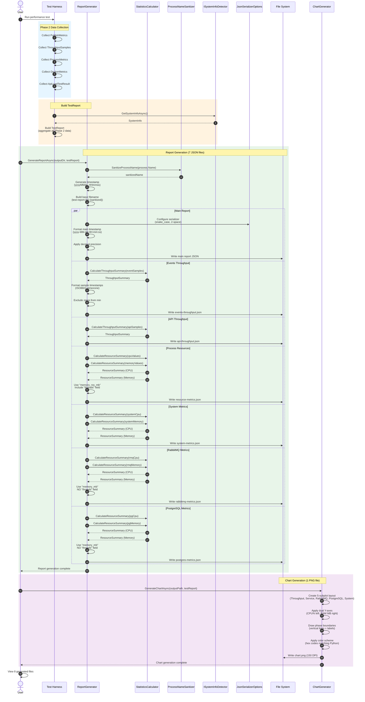

# Report Generator Architecture Guide

> **Companion Document to:**
> - `12.PHASE_3_REPORTING_PLAN.md` (Task 10-11)
> - `12.PHASE_3_REPORTING_PLAN.REPORT_GENERATOR_TEST_GUIDE.md`
>
> **Purpose:** Visual architecture and sequence diagrams explaining ReportGenerator design and flow

**Created:** 2025-01-13
**Status:** ✅ Ready for implementation

---

## Table of Contents

- [Overview](#overview)
- [Architecture Diagram](#architecture-diagram)
- [Component Descriptions](#component-descriptions)
- [Sequence Diagram](#sequence-diagram)
- [Data Flow](#data-flow)
- [File Generation Process](#file-generation-process)
- [Key Design Patterns](#key-design-patterns)
- [Integration Points](#integration-points)

---

## Overview

The **ReportGenerator** is the central component of Phase 3 Reporting that transforms raw performance test data into standardized JSON reports and visualizations. It acts as a **consumer slice** in the Vertical Slice Architecture, aggregating data from all Phase 2 producer slices (Event Publishing, Event Consuming, Process Monitoring, Docker Monitoring, API Load Testing).

**Core Responsibilities:**
1. **Aggregate** data from multiple Phase 2 sources
2. **Transform** raw metrics into statistical summaries
3. **Serialize** to JSON with exact Python-compatible format
4. **Generate** 8 files per test run (7 JSON + 1 PNG chart)

**Critical Success Factors:**
- ✅ Exact JSON structure matching Python implementation
- ✅ snake_case property names
- ✅ Decimal precision rules enforced
- ✅ Process name sanitization
- ✅ Statistical accuracy (sample standard deviation, zero handling)

---

## Architecture Diagram

```mermaid
graph TB
    subgraph "Phase 2 Producer Slices"
        EP[EventPublishing<br/>PublishMetrics]
        EC[EventConsuming<br/>ThroughputSample]
        PM[ProcessMonitoring<br/>ProcessMetrics]
        DM[DockerMonitoring<br/>DockerMetrics]
        ALT[ApiLoadTesting<br/>ApiLoadTestResult]
    end

    subgraph "Phase 3 Reporting Slice"
        direction TB

        subgraph "Models (Owned by Reporting)"
            TR[TestReport<br/>PhaseTimestamps<br/>TestConfiguration<br/>TestResults]
            SI[SystemInfo<br/>CpuInfo<br/>RamInfo<br/>DiskInfo]
            TRP[ThroughputReport<br/>ThroughputSummary<br/>ThroughputSampleJson]
            RMR[ResourceMetricsReport<br/>ResourceSummary<br/>ResourceSampleJson]
        end

        subgraph "Core Services"
            RG[ReportGenerator<br/>IReportGenerator]
            CG[ChartGenerator<br/>IChartGenerator]
            CRG[ComparisonReportGenerator<br/>IComparisonReportGenerator]
        end

        subgraph "Utilities"
            SC[StatisticsCalculator<br/>Statistical Functions]
            SID[ISystemInfoDetector<br/>WindowsSystemInfoDetector<br/>LinuxSystemInfoDetector]
            PNS[ProcessNameSanitizer<br/>5-Step Algorithm]
        end

        subgraph "Serialization"
            JSO[JsonSerializerOptions<br/>snake_case<br/>2-space indent]
            DTC[DateTime Converter<br/>ISO8601 formatter]
        end
    end

    subgraph "Output Files"
        F1[test-report-{ts}-{process}.json<br/>Main Summary]
        F2[test-report-{ts}-{process}.events-throughput.json<br/>Event Processing]
        F3[test-report-{ts}-{process}.api-throughput.json<br/>API Calls]
        F4[test-report-{ts}-{process}.resource-metrics.json<br/>Service CPU/RAM]
        F5[test-report-{ts}-{process}.system-metrics.json<br/>System-wide]
        F6[test-report-{ts}-{process}.rabbitmq-metrics.json<br/>RabbitMQ Container]
        F7[test-report-{ts}-{process}.postgres-metrics.json<br/>PostgreSQL Container]
        F8[test-report-{ts}-{process}.chart.png<br/>Visualization]
    end

    EP --> TR
    EC --> TR
    PM --> TR
    DM --> TR
    ALT --> TR

    TR --> RG
    SI --> RG
    SC --> RG
    SID --> SI
    PNS --> RG
    JSO --> RG
    DTC --> JSO

    RG --> F1
    RG --> F2
    RG --> F3
    RG --> F4
    RG --> F5
    RG --> F6
    RG --> F7

    TR --> CG
    CG --> F8

    style RG fill:#4CAF50,stroke:#2E7D32,stroke-width:3px,color:#fff
    style TR fill:#2196F3,stroke:#1565C0,stroke-width:2px,color:#fff
    style SI fill:#2196F3,stroke:#1565C0,stroke-width:2px,color:#fff
    style SC fill:#FF9800,stroke:#E65100,stroke-width:2px,color:#fff
```

**Legend:**
- **Green (ReportGenerator):** Primary entry point and orchestrator
- **Blue (Models):** Data structures owned by Reporting slice
- **Orange (Utilities):** Helper services and calculators
- **Gray (Output):** Generated files

---

## Component Descriptions

### Core Components

#### **ReportGenerator** (`IReportGenerator`)
**Role:** Primary orchestrator for JSON report generation
**Responsibilities:**
- Accepts `TestReport` and `outputDirectory` parameters
- Generates 7 JSON files per test run
- Orchestrates timestamp formatting, process name sanitization, and serialization
- Applies decimal precision rules to all metrics
- Differentiates between process and container metric formats

**Key Methods:**
```csharp
Task GenerateReportAsync(
    string outputDirectory,
    TestReport testReport,
    CancellationToken cancellationToken = default);
```

**Dependencies:**
- `StatisticsCalculator` - Statistical summary generation
- `ProcessNameSanitizer` - Filename sanitization
- `JsonSerializerOptions` - Serialization configuration
- `SystemInfo` - Hardware/OS information

---

#### **ChartGenerator** (`IChartGenerator`)
**Role:** Visualization generator using ScottPlot
**Responsibilities:**
- Creates PNG chart with 5 subplots (not 3!)
- Dual Y-axes for CPU/RAM plots
- Phase boundaries with vertical lines
- Exact color scheme matching Python matplotlib

**Key Methods:**
```csharp
Task GenerateChartAsync(
    string outputPath,
    TestReport testReport,
    CancellationToken cancellationToken = default);
```

---

#### **ComparisonReportGenerator** (`IComparisonReportGenerator`)
**Role:** Markdown comparison report generator
**Responsibilities:**
- Compares multiple test runs
- Generates Markdown tables with medal emojis (🥇🥈🥉)
- Sorts by "higher is better" or "lower is better"
- Highlights performance leaders

**Key Methods:**
```csharp
Task GenerateComparisonReportAsync(
    string outputPath,
    IEnumerable<TestReport> testReports,
    CancellationToken cancellationToken = default);
```

---

### Utility Components

#### **StatisticsCalculator**
**Role:** Statistical calculation utility (static class)
**Responsibilities:**
- Sample standard deviation (N-1, not N) using MathNet.Numerics
- Coefficient of variation (CV%)
- Mode calculation (most common rounded integer)
- Min calculation with zero exclusion
- Average response time calculation

**Key Methods:**
```csharp
double CalculateStandardDeviation(IEnumerable<double> values);
double CalculateCoefficientOfVariation(IEnumerable<double> values);
int CalculateMode(IEnumerable<double> values);
double CalculateMinExcludingZeros(IEnumerable<double> values);
ThroughputSummary CalculateThroughputSummary<T>(...);
ResourceSummary CalculateResourceSummary(IEnumerable<double> values, string unit);
```

---

#### **ISystemInfoDetector** (Strategy Pattern)
**Role:** Hardware and OS information detection
**Implementations:**
- `WindowsSystemInfoDetector` - WMI queries via System.Management
- `LinuxSystemInfoDetector` - /proc file parsing, WSL2 PowerShell queries

**Key Methods:**
```csharp
Task<SystemInfo?> GetSystemInfoAsync(CancellationToken cancellationToken = default);
```

**Platform Selection:** DI registration with `OSPlatformDetector` (common library)

---

#### **ProcessNameSanitizer**
**Role:** Filename sanitization utility
**Algorithm (5 steps):**
1. Remove file extensions (.jar, .dll, .exe)
2. Replace spaces and special chars with dashes
3. Remove consecutive dashes
4. Remove leading/trailing dashes
5. Convert to lowercase

**Examples:**
- `java21SpringBootGraalReferenceService` → `java21springbootgraalreferenceservice`
- `dotnet9AotReferenceService.exe` → `dotnet9aotreferenceservice`
- `python ReferenceService` → `pythonreferenceservice`

---

### Models

#### **TestReport**
**Purpose:** Aggregates all test data from Phase 2 slices
**Contains:**
- `TestDate` - Execution timestamp (UTC)
- `TotalRuntimeSeconds` - Test duration
- `PhaseTimestamps` - Phase boundaries (elapsed seconds)
- `MonitoredProcess` - Process name and PID
- `System` - Hardware/OS information
- `Configuration` - Test parameters (event count, API duration, etc.)
- `Results` - Aggregated results (Phase 1-3)

---

#### **SystemInfo**
**Purpose:** Hardware and OS information
**Contains:**
- `Os`, `OsRelease`, `OsVersion` - OS details
- `WslVersion` - WSL1/WSL2/null
- `Cpu` - Model, logical/physical processors, speed
- `Ram` - Total GB, speed, type, manufacturer
- `Disks` - Physical disks >= 500GB only

---

#### **ThroughputReport**
**Purpose:** Time-series throughput data with statistical summary
**Used for:**
- Events throughput (events/sec)
- API throughput (calls/sec)

**Contains:**
- `TestDate` - Timestamp string
- `SamplingIntervalMs` - 100ms for both events and API
- `Samples` - Time-series data (timestamp, rate, cumulative count)
- `Summary` - Statistical aggregation (avg, peak, min, stdDev, CV%, response time)

---

#### **ResourceMetricsReport**
**Purpose:** Time-series CPU/memory data with statistical summary
**Used for:**
- Process resources (500ms interval, `memory_rss_mb`, includes `threads`)
- Container metrics (3000ms interval, `memory_mb`, no `threads`)
- System metrics (500ms interval)

**Contains:**
- `TestDate` - Timestamp string
- `SamplingIntervalMs` - Varies by metric type
- `Samples` - Time-series data (timestamp, CPU%, memory MB)
- `CpuSummary`, `MemorySummary` - Statistical aggregation

---

## Sequence Diagram



---

## Data Flow

### Input Sources (Phase 2 Slices)

```
┌─────────────────────────────────────────────────────────────────┐
│                     Phase 2 Producer Slices                     │
├─────────────────────────────────────────────────────────────────┤
│                                                                 │
│  EventPublishing      → PublishMetrics (total events, duration) │
│  EventConsuming       → ThroughputSample[] (100ms samples)      │
│  ProcessMonitoring    → ProcessMetrics[] (500ms samples)        │
│  DockerMonitoring     → DockerMetrics[] (3000ms samples)        │
│  ApiLoadTesting       → ApiLoadTestResult (k6 output)           │
│                                                                 │
└─────────────────────────────────────────────────────────────────┘
                              │
                              │ Aggregated into
                              ▼
┌─────────────────────────────────────────────────────────────────┐
│                          TestReport                             │
├─────────────────────────────────────────────────────────────────┤
│                                                                 │
│  • TestDate (UTC)                                               │
│  • TotalRuntimeSeconds                                          │
│  • PhaseTimestamps (start/end times for each phase)             │
│  • MonitoredProcess (name, PID)                                 │
│  • SystemInfo (CPU, RAM, disks, OS)                             │
│  • Configuration (event count, API duration, endpoints)         │
│  • Results:                                                     │
│    - Phase1Publish (duration, throughput)                       │
│    - Phase2Consume (duration, throughput)                       │
│    - Phase3Api (duration, requests, throughput, success%)       │
│                                                                 │
└─────────────────────────────────────────────────────────────────┘
                              │
                              │ Processed by
                              ▼
┌─────────────────────────────────────────────────────────────────┐
│                       ReportGenerator                           │
├─────────────────────────────────────────────────────────────────┤
│                                                                 │
│  1. Sanitize process name (5-step algorithm)                    │
│  2. Generate timestamp (yyyyMMdd_HHmmss)                        │
│  3. Calculate statistics (StatisticsCalculator)                 │
│  4. Transform data to report models                             │
│  5. Apply decimal precision rules                               │
│  6. Format timestamps (main vs samples)                         │
│  7. Serialize to JSON (snake_case, 2-space indent)              │
│  8. Write 7 JSON files                                          │
│                                                                 │
└─────────────────────────────────────────────────────────────────┘
                              │
                              │ Outputs
                              ▼
┌─────────────────────────────────────────────────────────────────┐
│                      8 Generated Files                          │
├─────────────────────────────────────────────────────────────────┤
│                                                                 │
│  1. test-report-{ts}-{process}.json                             │
│  2. test-report-{ts}-{process}.events-throughput.json           │
│  3. test-report-{ts}-{process}.api-throughput.json              │
│  4. test-report-{ts}-{process}.resource-metrics.json            │
│  5. test-report-{ts}-{process}.system-metrics.json              │
│  6. test-report-{ts}-{process}.rabbitmq-metrics.json            │
│  7. test-report-{ts}-{process}.postgres-metrics.json            │
│  8. test-report-{ts}-{process}.chart.png                        │
│                                                                 │
└─────────────────────────────────────────────────────────────────┘
```

---

## File Generation Process

### Detailed Workflow per File Type

#### **1. Main Report** (`test-report-{ts}-{process}.json`)
```
Input: TestReport
↓
1. Extract configuration and results
2. Format TestDate: "yyyy-MM-dd HH:mm:ss" (no timezone)
3. Round phase timestamps to 3 decimals
4. Round throughput values to 2 decimals
5. Round percentages to 1 decimal
6. Serialize with snake_case property names
7. Write with 2-space indentation
↓
Output: Main summary JSON
```

---

#### **2-3. Throughput Reports** (Events, API)
```
Input: ThroughputSample[] or ApiThroughputSample[]
↓
1. Extract rate values: samples.Select(s => s.Rate).ToList()
2. Calculate statistics using StatisticsCalculator:
   - AvgRate = CalculateAverage(rates)
   - PeakRate = CalculateMax(rates)
   - MinRate = CalculateMinExcludingZeros(rates) ← Excludes zeros
   - StdDevRate = CalculateStandardDeviation(rates) ← Sample (N-1)
   - CvRate = CalculateCoefficientOfVariation(rates) ← (stdDev/mean)*100
   - AvgResponseTimeMs = 1000.0 / AvgRate
3. Apply decimal precision:
   - Rates: 2 decimals
   - CV%: 1 decimal
   - Response time: 3 decimals
4. Format sample timestamps: ISO8601 with timezone
   - Format: "yyyy-MM-ddTHH:mm:ss.ffffff+00:00"
5. Build ThroughputReport model
6. Serialize with snake_case
7. Write with 2-space indentation
↓
Output: events-throughput.json or api-throughput.json
```

**Critical:** Min calculation **excludes zeros** (post-test measurements), but average **includes zeros** (accurate representation).

---

#### **4. Process Resources** (`resource-metrics.json`)
```
Input: ProcessMetrics[]
↓
1. Extract CPU values: metrics.Select(m => m.CpuPercent).ToList()
2. Extract memory values: metrics.Select(m => m.MemoryRssMb).ToList()
3. Calculate CPU summary: CalculateResourceSummary(cpuValues, "%")
4. Calculate memory summary: CalculateResourceSummary(memoryValues, "MB")
5. Apply decimal precision:
   - CPU%: 2 decimals
   - Memory MB: 2 decimals
6. Build ResourceMetricsReport model with:
   - SamplingIntervalMs = 500
   - Property name: "memory_rss_mb" (NOT "memory_mb")
   - Include "threads" field
7. Format sample timestamps: ISO8601 with timezone
8. Serialize with snake_case
9. Write with 2-space indentation
↓
Output: resource-metrics.json
```

---

#### **5-7. Container & System Metrics** (RabbitMQ, PostgreSQL, System)
```
Input: DockerMetrics[] or SystemMetrics[]
↓
1. Extract CPU and memory values
2. Calculate CPU and memory summaries
3. Apply decimal precision (2 decimals)
4. Build ResourceMetricsReport model with:
   - For containers:
     • SamplingIntervalMs = 3000
     • Property name: "memory_mb" (NOT "memory_rss_mb")
     • NO "threads" field
   - For system:
     • SamplingIntervalMs = 500
5. Format sample timestamps: ISO8601 with timezone
6. Serialize with snake_case
7. Write with 2-space indentation
↓
Output: {type}-metrics.json
```

**Critical Difference:**
- **Process metrics:** Use `memory_rss_mb`, include `threads` field, 500ms interval
- **Container metrics:** Use `memory_mb`, NO `threads` field, 3000ms interval

---

#### **8. Chart** (`chart.png`)
```
Input: TestReport
↓
1. Create 5-subplot layout (not 3!):
   - Subplot 1: Throughput (events/sec, API calls/sec)
   - Subplot 2: Service Resources (CPU%, RAM MB) ← Dual Y-axes
   - Subplot 3: RabbitMQ (CPU%, RAM MB) ← Dual Y-axes
   - Subplot 4: PostgreSQL (CPU%, RAM MB) ← Dual Y-axes
   - Subplot 5: System (CPU%, RAM MB) ← Dual Y-axes
2. Apply exact color scheme (hex codes)
3. Draw phase boundaries (vertical lines with labels)
4. Position legend outside right edge
5. Set title: "Performance Metrics - {process} - {date}"
6. Export as PNG (150 DPI)
↓
Output: chart.png
```

---

## Key Design Patterns

### 1. **Vertical Slice Architecture**
**Pattern:** Consumer-owned contracts
**Implementation:**
- Reporting slice **consumes** models from Phase 2 slices (read-only)
- Does NOT modify Phase 2 models
- Owns its output models (`TestReport`, `ThroughputReport`, etc.)
- No BackgroundService pattern (one-time report generation)

---

### 2. **Strategy Pattern** (SystemInfoDetector)
**Pattern:** Platform-specific implementations
**Implementation:**
```csharp
// No #if directives in implementations
internal sealed class WindowsSystemInfoDetector : ISystemInfoDetector { }
internal sealed class LinuxSystemInfoDetector : ISystemInfoDetector { }

// Platform selection at DI registration
var platformDetector = new OSPlatformDetector();
var platform = platformDetector.GetCurrentPlatform();
switch (platform)
{
    case SupportedPlatform.Linux:
        services.AddSingleton<ISystemInfoDetector, LinuxSystemInfoDetector>();
        break;
    case SupportedPlatform.Windows:
        services.AddSingleton<ISystemInfoDetector, WindowsSystemInfoDetector>();
        break;
}
```

---

### 3. **Lazy Initialization** (SystemInfoDetector)
**Pattern:** Expensive operation caching
**Implementation:**
```csharp
private readonly Lazy<Task<SystemInfo?>> _systemInfoCache;

public WindowsSystemInfoDetector()
{
    _systemInfoCache = new Lazy<Task<SystemInfo?>>(
        () => DetectSystemInfoInternalAsync(CancellationToken.None));
}

public Task<SystemInfo?> GetSystemInfoAsync(CancellationToken cancellationToken)
{
    return _systemInfoCache.Value; // Called once, cached forever
}
```

**Why:** Hardware detection (WMI queries, /proc parsing) is expensive (100-500ms)

---

### 4. **Source-Generated JSON Serialization** (AOT-compatible)
**Pattern:** Compile-time code generation
**Implementation:**
```csharp
JsonSerializerOptions options = new()
{
    PropertyNamingPolicy = JsonNamingPolicy.SnakeCaseLower,
    WriteIndented = true,
    Converters = { new DateTimeConverter() } // Custom ISO8601 formatter
};

// Source generators create serialization code at compile-time
// No reflection needed (AOT-compatible)
string json = JsonSerializer.Serialize(testReport, options);
```

---

### 5. **Statistical Accuracy** (MathNet.Numerics)
**Pattern:** Use industry-standard library for correctness
**Implementation:**
```csharp
// Sample standard deviation (N-1) - matches Python statistics.stdev()
var stdDev = Statistics.StandardDeviation(values);

// NOT this (population standard deviation):
var variance = values.Sum(v => Math.Pow(v - mean, 2)) / values.Count; // Wrong!
```

**Why:** Ensures exact match with Python implementation

---

## Integration Points

### **Dependency Injection Registration**
```csharp
public static IServiceCollection AddReporting(this IServiceCollection services)
{
    // Platform-specific SystemInfoDetector
    var platformDetector = new OSPlatformDetector();
    var platform = platformDetector.GetCurrentPlatform();
    switch (platform)
    {
        case SupportedPlatform.Linux:
            services.AddSingleton<ISystemInfoDetector, LinuxSystemInfoDetector>();
            break;
        case SupportedPlatform.Windows:
            services.AddSingleton<ISystemInfoDetector, WindowsSystemInfoDetector>();
            break;
        default:
            throw new PlatformNotSupportedException($"Platform {platform} is not supported.");
    }

    // Core services
    services.AddSingleton<IReportGenerator, ReportGenerator>();
    services.AddSingleton<IChartGenerator, ChartGenerator>();
    services.AddSingleton<IComparisonReportGenerator, ComparisonReportGenerator>();

    return services;
}
```

---

### **Usage Example**
```csharp
// In test harness or orchestrator
var serviceProvider = new ServiceCollection()
    .AddReporting()
    .BuildServiceProvider();

var reportGenerator = serviceProvider.GetRequiredService<IReportGenerator>();
var chartGenerator = serviceProvider.GetRequiredService<IChartGenerator>();

// Build TestReport from Phase 2 data
var testReport = new TestReport
{
    TestDate = DateTime.UtcNow,
    TotalRuntimeSeconds = 125.456,
    MonitoredProcess = new MonitoredProcess { Name = "goReferenceService", Pid = 12345 },
    System = systemInfo,
    Configuration = testConfig,
    Results = testResults
};

// Generate reports
await reportGenerator.GenerateReportAsync("/output", testReport);
await chartGenerator.GenerateChartAsync("/output/chart.png", testReport);

// Result: 8 files in /output directory
```

---

### **File System Output**
```
/output/
├── test-report-20251113_142530-goreferenceservice.json                    # Main
├── test-report-20251113_142530-goreferenceservice.events-throughput.json  # Events
├── test-report-20251113_142530-goreferenceservice.api-throughput.json     # API
├── test-report-20251113_142530-goreferenceservice.resource-metrics.json   # Process
├── test-report-20251113_142530-goreferenceservice.system-metrics.json     # System
├── test-report-20251113_142530-goreferenceservice.rabbitmq-metrics.json   # RabbitMQ
├── test-report-20251113_142530-goreferenceservice.postgres-metrics.json   # PostgreSQL
└── test-report-20251113_142530-goreferenceservice.chart.png               # Chart
```

---

## Summary

The **ReportGenerator** architecture demonstrates:

1. **Vertical Slice Architecture** - Consumer slice with owned models
2. **Platform Abstraction** - Strategy pattern for OS-specific detection
3. **Performance** - Lazy initialization for expensive operations
4. **Accuracy** - Statistical calculations matching Python exactly
5. **Compatibility** - AOT-friendly JSON serialization
6. **Maintainability** - Clear separation of concerns (generation, calculation, serialization)

**Critical Success Factors:**
- ✅ Exact JSON format matching Python output
- ✅ Statistical accuracy (sample stdDev, zero handling)
- ✅ Decimal precision enforcement
- ✅ Process vs container metric differentiation
- ✅ Cross-platform support (Windows/Linux)

---

**Document Version:** 1.0
**Last Updated:** 2025-01-13
**Status:** ✅ Ready for implementation

**Reference Documents:**
- `12.PHASE_3_REPORTING_PLAN.md` - Complete implementation plan
- `12.PHASE_3_REPORTING_PLAN.REPORT_GENERATOR_TEST_GUIDE.md` - Test implementation guide
- `/workspace/performance-tester/PYTHON_FILE_FORMATS.md` - File format specifications
- `/workspace/performance-tester/report_generator.py` - Python reference implementation
