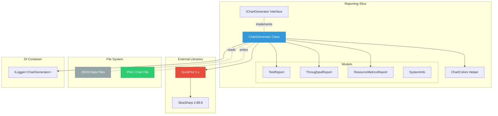
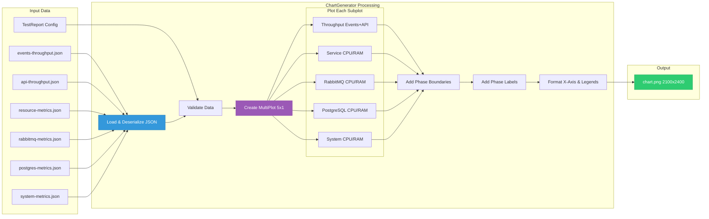
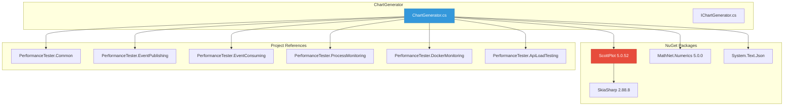
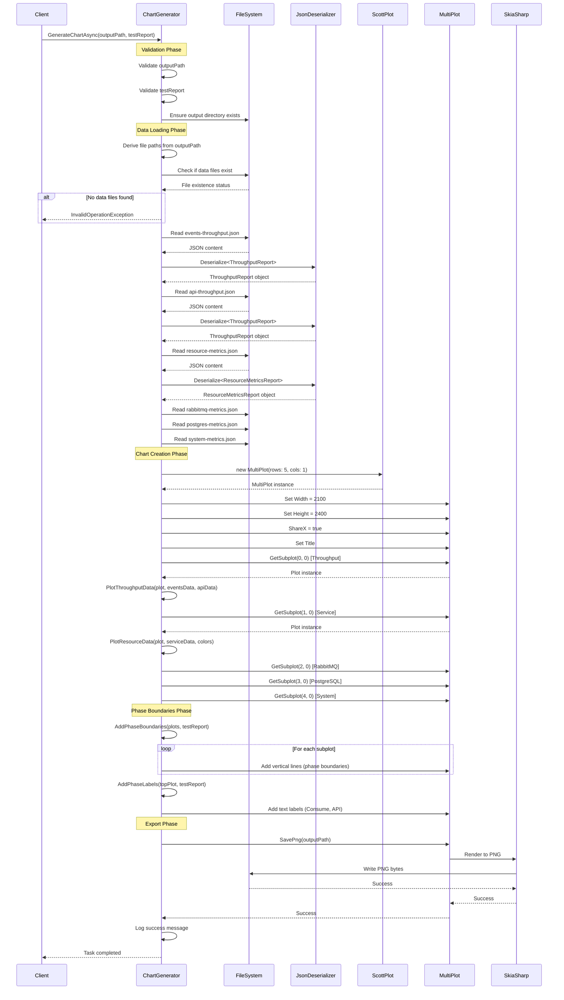
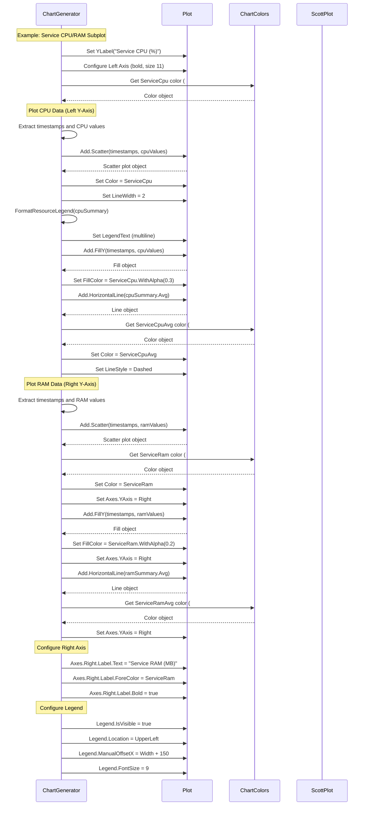
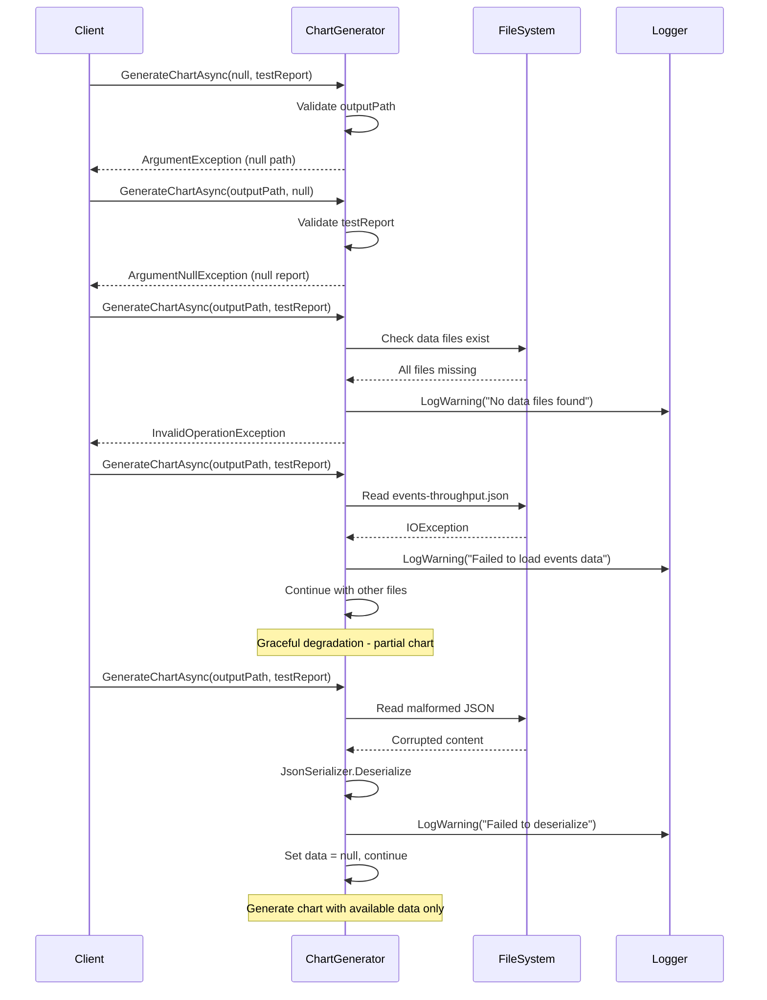
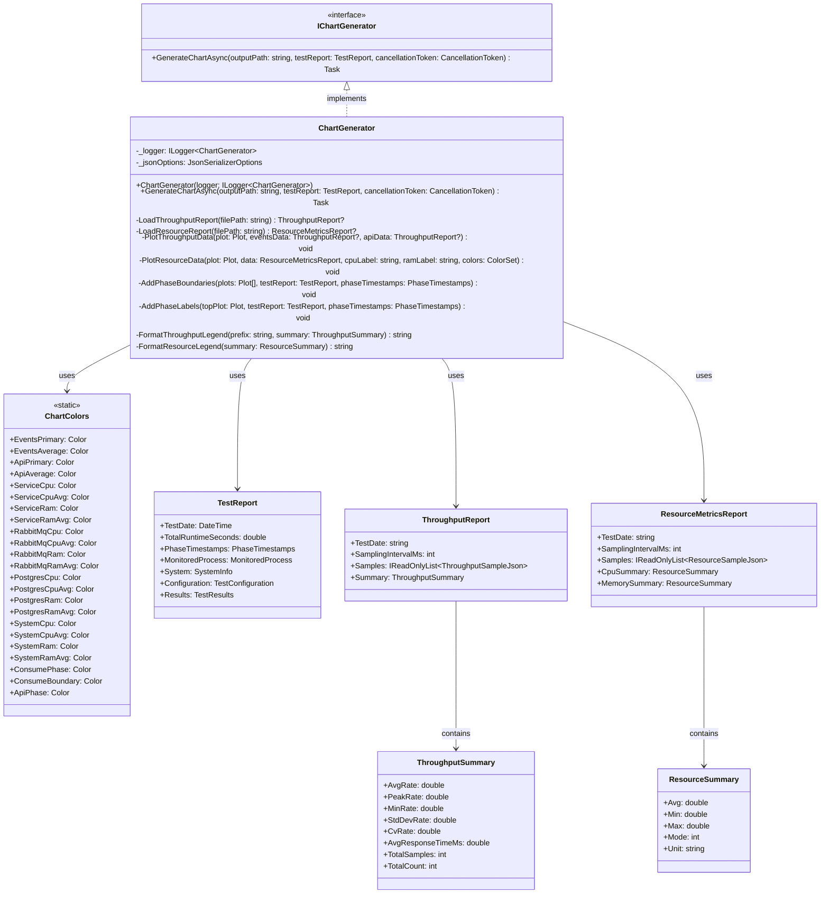
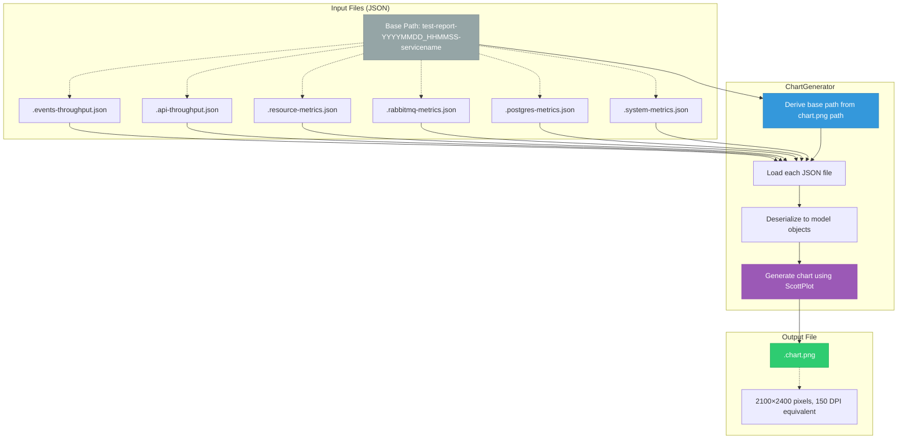

# ChartGenerator Architecture and Sequence Diagrams

> **For Claude:** This document provides architectural overview and sequence diagrams for the ChartGenerator implementation.

**Related Files:**
- Main Plan: `12.PHASE_3_REPORTING_PLAN.md` (Task 12-14)
- Test Guide: `12.PHASE_3_REPORTING_PLAN.CHARTGENERATOR_TESTS.md`
- Implementation: `PerformanceTester.Reporting/ChartGenerator.cs`
- Tests: `PerformanceTester.Reporting.IntegrationTests/ChartGeneratorTests.cs`

**Status:** 📋 Ready for implementation (Created: 2025-01-14)

---

## Table of Contents

- [Overview](#overview)
- [Architecture Diagram](#architecture-diagram)
  - [Component Structure](#component-structure)
  - [Data Flow](#data-flow)
  - [Dependencies](#dependencies)
- [Sequence Diagram](#sequence-diagram)
  - [Main Generation Flow](#main-generation-flow)
  - [Subplot Creation Flow](#subplot-creation-flow)
  - [Error Handling Flow](#error-handling-flow)
- [Class Diagram](#class-diagram)
- [File System Interaction](#file-system-interaction)
- [ScottPlot Integration Details](#scottplot-integration-details)

---

## Overview

The **ChartGenerator** is responsible for creating comprehensive performance visualization charts that combine throughput, CPU, and RAM metrics across multiple dimensions (service, containers, system-wide). It generates PNG files with 5 subplots that exactly match the Python matplotlib implementation's layout, colors, and formatting.

**Key Responsibilities:**
1. Load metrics data from 6 JSON files
2. Create 5-subplot layout using ScottPlot MultiPlot
3. Plot time-series data with dual Y-axes for resource metrics
4. Apply exact color scheme (16 colors) matching Python implementation
5. Add phase boundary markers and labels
6. Format legends with multiline statistics
7. Export PNG at 2100×2400 pixels (150 DPI equivalent)

---

## Architecture Diagram

### Component Structure



### Data Flow



### Dependencies



---

## Sequence Diagram

### Main Generation Flow



### Subplot Creation Flow



### Error Handling Flow



---

## Class Diagram



---

## File System Interaction



**Example File Paths:**

Given output path: `/workspace/test-results/test-report-20250113_142530-dotnet9aotreferenceservice.chart.png`

ChartGenerator derives:
- Base path: `/workspace/test-results/test-report-20250113_142530-dotnet9aotreferenceservice`
- Events: `{base}.events-throughput.json`
- API: `{base}.api-throughput.json`
- Service: `{base}.resource-metrics.json`
- RabbitMQ: `{base}.rabbitmq-metrics.json`
- Postgres: `{base}.postgres-metrics.json`
- System: `{base}.system-metrics.json`

---

## ScottPlot Integration Details

```mermaid
graph TB
    subgraph "ScottPlot 5.x API Usage"
        MultiPlot[MultiPlot rows:5, cols:1]

        subgraph "Subplot 1: Throughput"
            T1[GetSubplot 0,0]
            T2[Add.Scatter events]
            T3[Add.Scatter API]
            T4[Add.HorizontalLine avg]
            T5[Legend outside right]
        end

        subgraph "Subplots 2-5: Resources"
            R1[GetSubplot 1-4,0]
            R2[Add.Scatter CPU left axis]
            R3[Add.FillY CPU alpha 0.3]
            R4[Add.Scatter RAM right axis]
            R5[Add.FillY RAM alpha 0.2]
            R6[Add.HorizontalLine avg both]
            R7[Legend outside right]
        end

        subgraph "All Subplots"
            P1[Add.VerticalLine phase boundaries]
            P2[Add.Text phase labels top subplot]
            P3[Format X-axis bottom HH:MM:SS]
        end

        Export[SavePng 2100×2400]
        SkiaSharp[SkiaSharp Rendering]
        PNG[PNG File Output]

        MultiPlot --> T1
        T1 --> T2
        T2 --> T3
        T3 --> T4
        T4 --> T5

        MultiPlot --> R1
        R1 --> R2
        R2 --> R3
        R3 --> R4
        R4 --> R5
        R5 --> R6
        R6 --> R7

        T5 --> P1
        R7 --> P1
        P1 --> P2
        P2 --> P3
        P3 --> Export
        Export --> SkiaSharp
        SkiaSharp --> PNG
    end

    style MultiPlot fill:#e74c3c,stroke:#c0392b,color:#fff
    style Export fill:#9b59b6,stroke:#8e44ad,color:#fff
    style PNG fill:#2ecc71,stroke:#27ae60,color:#fff
```



**Key ScottPlot Patterns:**

1. **MultiPlot for Subplots:**
   ```csharp
   var multiPlot = new ScottPlot.MultiPlot(rows: 5, cols: 1);
   multiPlot.Width = 2100;
   multiPlot.Height = 2400;
   multiPlot.ShareX = true;
   ```

2. **Dual Y-Axes:**
   ```csharp
   // Left axis (CPU)
   var cpuScatter = plot.Add.Scatter(timestamps, cpuValues);
   cpuScatter.Axes.YAxis = plot.Axes.Left; // Default

   // Right axis (RAM)
   var ramScatter = plot.Add.Scatter(timestamps, ramValues);
   ramScatter.Axes.YAxis = plot.Axes.Right; // Explicit assignment
   ```

3. **Color with Alpha:**
   ```csharp
   var color = ScottPlot.Color.FromHex("#3498db");
   var fillColor = color.WithAlpha(0.3); // 30% opacity
   ```

4. **Legend Positioning:**
   ```csharp
   plot.Legend.IsVisible = true;
   plot.Legend.Location = Alignment.UpperLeft;
   plot.Legend.ManualOffsetX = plot.Width + 150; // Outside right edge
   ```

5. **Multiline Legend Text:**
   ```csharp
   scatter.LegendText = $"Avg: {avg:F1} %\n" +
                        $"Min: {min:F1} %\n" +
                        $"Max: {max:F1} %\n" +
                        $"Mode: {mode} %";
   ```

6. **Phase Boundaries:**
   ```csharp
   foreach (var plot in allPlots)
   {
       var vline = plot.Add.VerticalLine(timestamp);
       vline.Color = ChartColors.ConsumePhase;
       vline.LineStyle = LineStyle.Dotted;
       vline.LineWidth = 1.5;
       vline.Alpha = 0.6;
   }
   ```

7. **PNG Export:**
   ```csharp
   multiPlot.SavePng(outputPath);
   // Automatically uses configured Width/Height
   // 2100×2400 pixels = 14"×16" at 150 DPI
   ```

---

## Summary

This architecture document provides:

1. **Component Structure** - How ChartGenerator fits into the Reporting slice
2. **Data Flow** - How JSON data flows through the chart generation pipeline
3. **Dependencies** - External libraries and project references
4. **Sequence Diagrams** - Step-by-step execution flows
5. **Class Diagram** - Object relationships and responsibilities
6. **File System Interaction** - Input/output file patterns
7. **ScottPlot Integration** - Detailed library usage patterns

**Key Architectural Decisions:**

- **Single Responsibility:** ChartGenerator only generates charts; data collection handled by other slices
- **Graceful Degradation:** Missing data files result in partial charts, not complete failure
- **Exact Python Match:** All visual elements (colors, layout, formatting) match Python matplotlib output
- **Cross-Platform:** ScottPlot + SkiaSharp work on Windows, Linux, macOS (headless rendering)
- **Testability:** File-based assertions and indirect verification for chart validation

**Implementation Order:**

1. Create ChartColors helper class (static color definitions)
2. Implement IChartGenerator interface
3. Implement ChartGenerator class structure
4. Implement data loading methods (LoadThroughputReport, LoadResourceReport)
5. Implement plotting methods (PlotThroughputData, PlotResourceData)
6. Implement phase boundary methods (AddPhaseBoundaries, AddPhaseLabels)
7. Implement legend formatting methods
8. Implement main GenerateChartAsync method
9. Write integration tests following test guide
10. Visual comparison with Python output

---

**Last Updated:** 2025-01-14
**Status:** 📋 Architecture finalized, ready for implementation
**Related Documents:**
- Main Plan: `12.PHASE_3_REPORTING_PLAN.md`
- Test Guide: `12.PHASE_3_REPORTING_PLAN.CHARTGENERATOR_TESTS.md`
