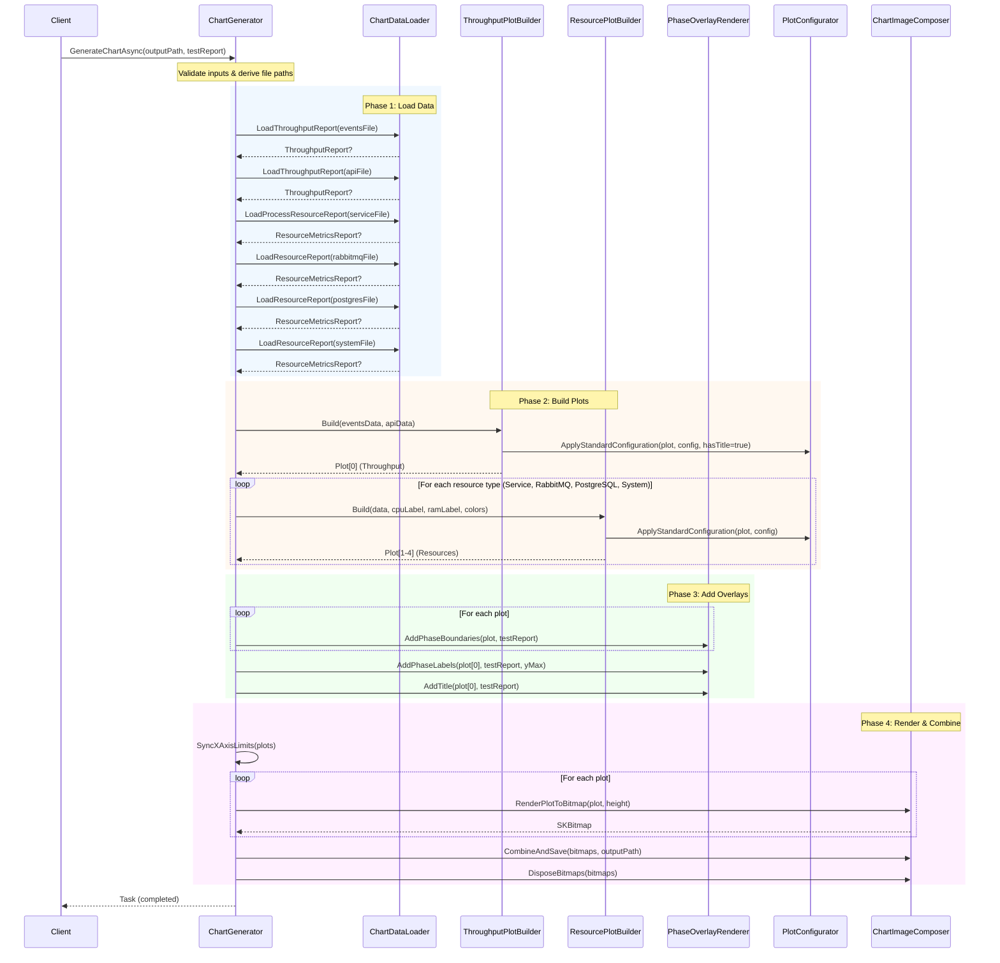

# ChartGenerator Refactoring Implementation Plan

> **Status:** COMPLETED (2026-01-30)

**Goal:** Refactor the monolithic `ChartGenerator` class (914 lines) into smaller, focused classes using composition, with configuration passed as readonly records.

**Architecture:** Extract 5 subplot creation responsibilities into dedicated classes (`ThroughputPlotBuilder`, `ResourcePlotBuilder`), with shared plot configuration through composition (not inheritance). Common operations (time axis, legend, grid, layout) are centralized in a `PlotConfigurator` helper.

**Tech Stack:** .NET 9, ScottPlot 5.x, SkiaSharp

---

## Analysis Summary

### Current Problems (Before Refactoring)

1. **Single Responsibility Violation**: ChartGenerator handles:
   - Throughput plotting (events + API)
   - Resource plotting (4 different metric types)
   - Data loading (3 different JSON formats)
   - Image composition (bitmap combining)
   - Phase boundary/label rendering

2. **Code Duplication**:
   - Legend configuration repeated 5×
   - Axis label configuration repeated 8×
   - Grid configuration repeated 5×
   - Time axis configuration called 5×
   - Layout.Fixed called 5× with nearly identical padding

3. **Magic Numbers**: Font sizes (36, 26, 22), line widths (4f, 3f), paddings (100, 480, 50, 100) scattered throughout

4. **Parameter Bloat**: `CreateResourcePlot` has 7 parameters (plus implicit `this`)

---

## Architecture Diagram

```mermaid
classDiagram
    class ChartGenerator {
        -ILogger _logger
        -ChartConfig _config
        -ChartDataLoader _dataLoader
        -ThroughputPlotBuilder _throughputBuilder
        -ResourcePlotBuilder _resourceBuilder
        -PhaseOverlayRenderer _phaseRenderer
        -ChartImageComposer _imageComposer
        +GenerateChartAsync(outputPath, testReport)
    }

    class ChartConfig {
        <<record>>
        +FontConfig Font
        +LineConfig Line
        +PlotDimensions Dimensions
        +GridConfig Grid
        +static Default
    }

    class FontConfig {
        <<record>>
        +string FontName
        +float TitleFontSize
        +float AxisLabelFontSize
        +float LegendFontSize
        +float PhaseLabelFontSize
    }

    class LineConfig {
        <<record>>
        +float PrimaryLineWidth
        +float AverageLineWidth
        +float BoundaryLineWidth
        +double PrimaryFillAlpha
        +double SecondaryFillAlpha
    }

    class PlotDimensions {
        <<record>>
        +int Width
        +int Height
        +int ThroughputHeight
        +int PaddingLeft/Right/Top/Bottom
    }

    class ChartDataLoader {
        -ILogger _logger
        +LoadThroughputReport(filePath)
        +LoadResourceReport(filePath)
        +LoadProcessResourceReport(filePath)
    }

    class ThroughputPlotBuilder {
        -ChartConfig _config
        +Build(eventsData, apiData) Plot
    }

    class ResourcePlotBuilder {
        -ChartConfig _config
        +Build(data, cpuLabel, ramLabel, colors) Plot
    }

    class ResourcePlotColors {
        <<record>>
        +Color CpuPrimary
        +Color CpuAverage
        +Color RamPrimary
        +Color RamAverage
    }

    class PlotConfigurator {
        <<static>>
        +ConfigureTimeAxis(plot)
        +ConfigureGrid(plot, config)
        +ConfigureLegend(plot, fontConfig)
        +ConfigureLayout(plot, dimensions, hasTitle)
        +ConfigureAxisLabel(axis, text, color, fontConfig)
        +ApplyStandardConfiguration(plot, config, hasTitle)
    }

    class PhaseOverlayRenderer {
        -ChartConfig _config
        +AddPhaseBoundaries(plot, testReport)
        +AddPhaseLabels(plot, testReport, yMax)
        +AddTitle(plot, testReport)
    }

    class ChartImageComposer {
        -PlotDimensions _dimensions
        +RenderPlotToBitmap(plot, height) SKBitmap
        +CombineAndSave(bitmaps, outputPath)
        +DisposeBitmaps(bitmaps)$
    }

    ChartGenerator --> ChartConfig
    ChartGenerator --> ChartDataLoader
    ChartGenerator --> ThroughputPlotBuilder
    ChartGenerator --> ResourcePlotBuilder
    ChartGenerator --> PhaseOverlayRenderer
    ChartGenerator --> ChartImageComposer

    ChartConfig --> FontConfig
    ChartConfig --> LineConfig
    ChartConfig --> PlotDimensions
    ChartConfig --> GridConfig

    ThroughputPlotBuilder --> PlotConfigurator
    ResourcePlotBuilder --> PlotConfigurator
    ResourcePlotBuilder --> ResourcePlotColors

    PhaseOverlayRenderer --> ChartColors
    ThroughputPlotBuilder --> ChartColors
```



---

## Sequence Diagram



---

## File Structure (After Refactoring)

```
src/PerformanceTester.Reporting/ChartGeneration/
├── ChartGenerator.cs              # Orchestrator (~234 lines, was 914)
├── ChartColors.cs                 # Color constants (unchanged)
├── Configuration/
│   └── ChartConfig.cs             # Immutable config records (~176 lines)
├── DataLoading/
│   └── ChartDataLoader.cs         # JSON parsing (~412 lines)
├── ImageComposition/
│   └── ChartImageComposer.cs      # Bitmap operations (~65 lines)
├── PlotBuilders/
│   ├── ThroughputPlotBuilder.cs   # Throughput subplot (~107 lines)
│   └── ResourcePlotBuilder.cs     # CPU/RAM dual-axis subplot (~153 lines)
└── PlotConfiguration/
    ├── PlotConfigurator.cs        # Shared plot setup (~105 lines)
    └── PhaseOverlayRenderer.cs    # Phase boundaries & labels (~109 lines)
```

---

## Implementation Tasks

| Task | Description | Files Created/Modified |
|------|-------------|----------------------|
| 1 | Create configuration records | `Configuration/ChartConfig.cs` |
| 2 | Create PlotConfigurator | `PlotConfiguration/PlotConfigurator.cs` |
| 3 | Create ThroughputPlotBuilder | `PlotBuilders/ThroughputPlotBuilder.cs` |
| 4 | Create ResourcePlotBuilder | `PlotBuilders/ResourcePlotBuilder.cs` |
| 5 | Create ChartDataLoader | `DataLoading/ChartDataLoader.cs` |
| 6 | Create ChartImageComposer | `ImageComposition/ChartImageComposer.cs` |
| 7 | Create PhaseOverlayRenderer | `PlotConfiguration/PhaseOverlayRenderer.cs` |
| 8 | Refactor ChartGenerator | `ChartGenerator.cs` (rewrite as orchestrator) |
| 9 | Run full test suite | Verify all 446 tests pass |
| 10 | Final cleanup | Verify file structure and no warnings |

---

## Summary of Changes

| Metric | Before | After |
|--------|--------|-------|
| Files | 1 | 8 |
| Lines (ChartGenerator) | 914 | 234 |
| Total Lines | 914 | ~1,100 |
| Magic Numbers | Scattered | Centralized in `ChartConfig` |
| Legend Config | 5× duplicated | 1× in `PlotConfigurator` |
| Axis Config | 8× duplicated | 1× in `PlotConfigurator` |
| Parameter Count (CreateResourcePlot) | 7 | 4 (via `ResourcePlotColors` record) |

### Key Design Decisions

1. **Composition over Inheritance**: All components receive `ChartConfig` via constructor injection
2. **Immutable Configuration**: All config types are `sealed record` with static `Default` instances
3. **Static Helper**: `PlotConfigurator` is static since it has no state
4. **Color Records**: `ResourcePlotColors` groups 4 related colors to reduce parameter count
5. **Single Responsibility**: Each class has one clear purpose

### Public API

**Unchanged** - `IChartGenerator` interface and `ChartGenerator` constructor signature preserved. All 11 existing tests pass without modification.

---

## Commits (8 total)

1. `feat(ChartGeneration): add configuration records for chart styling`
2. `feat(ChartGeneration): add PlotConfigurator for shared plot setup`
3. `feat(ChartGeneration): add ThroughputPlotBuilder`
4. `feat(ChartGeneration): add ResourcePlotBuilder for CPU/RAM subplots`
5. `feat(ChartGeneration): add ChartDataLoader for JSON parsing`
6. `feat(ChartGeneration): add ChartImageComposer for bitmap operations`
7. `feat(ChartGeneration): add PhaseOverlayRenderer for phase markers`
8. `refactor(ChartGeneration): rewrite ChartGenerator as orchestrator`
