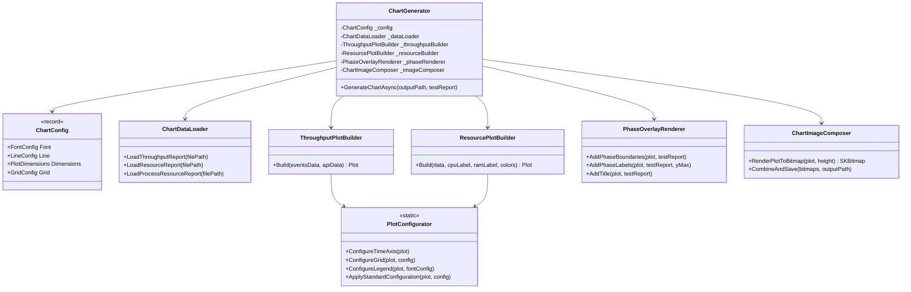
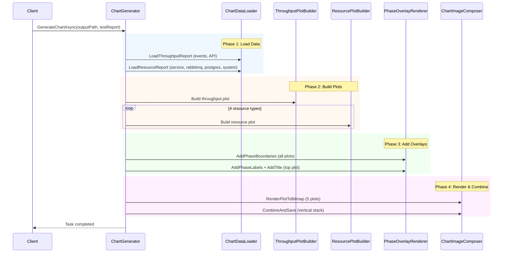

# Chart Generation

Generates performance visualization charts using ScottPlot with 5 vertically-stacked subplots:

1. **Throughput** - Events/sec and API calls/sec with averages
2. **Service Resources** - CPU% and RAM (dual Y-axes) for the monitored process
3. **RabbitMQ Resources** - CPU% and RAM for the message broker container
4. **PostgreSQL Resources** - CPU% and RAM for the database container
5. **System Resources** - Overall system CPU% and RAM

## Architecture

The `ChartGenerator` orchestrates specialized components, each with a single responsibility:



## Execution Flow

Chart generation proceeds through four phases:



## File Structure

```
ChartGeneration/
├── ChartGenerator.cs              # Orchestrator
├── ChartColors.cs                 # Color constants
├── Configuration/
│   └── ChartConfig.cs             # Immutable config records
├── DataLoading/
│   └── ChartDataLoader.cs         # JSON file parsing
├── ImageComposition/
│   └── ChartImageComposer.cs      # Bitmap rendering and stacking
├── PlotBuilders/
│   ├── ThroughputPlotBuilder.cs   # Events/API throughput subplot
│   └── ResourcePlotBuilder.cs     # CPU/RAM dual-axis subplot
└── PlotConfiguration/
    ├── PlotConfigurator.cs        # Shared plot setup (grid, legend, axes)
    └── PhaseOverlayRenderer.cs    # Phase boundaries and labels
```

## Configuration

All styling is centralized in `ChartConfig`, which composes:

- **FontConfig** - Font family, sizes for title/axis/legend/phase labels
- **LineConfig** - Line widths, fill alphas
- **PlotDimensions** - Width, height, padding
- **GridConfig** - Grid line color and alpha

Each config type is an immutable `record` with a static `Default` instance, allowing easy customization via `with` expressions.

## Usage

```csharp
var chartGenerator = serviceProvider.GetRequiredService<IChartGenerator>();

await chartGenerator.GenerateChartAsync(
    outputPath: "/path/to/test-report.chart.png",
    testReport: testReport);
```

The chart generator reads JSON data files from the same directory as the output path:
- `*.events-throughput.json`
- `*.api-throughput.json`
- `*.resource-metrics.json`
- `*.rabbitmq-metrics.json`
- `*.postgres-metrics.json`
- `*.system-metrics.json`
