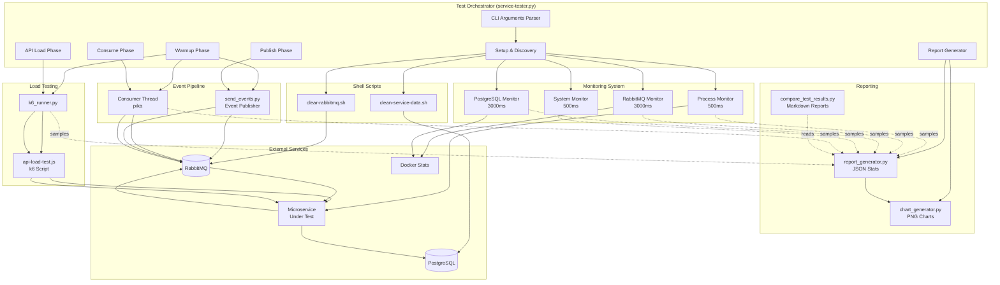

# Performance Tester Architecture Documentation

## Executive Summary

The performance-tester is a Python-based load testing and benchmarking framework designed to measure microservice performance across three dimensions:
1. **Event Throughput** - RabbitMQ consumption and publishing rate
2. **API Throughput** - HTTP endpoint performance under load
3. **Resource Efficiency** - CPU and RAM usage of service and infrastructure

The system orchestrates test phases, collects multi-dimensional metrics from 5 concurrent monitors, and produces comprehensive JSON reports with visualizations.

---

## High-Level Architecture



---

## Component Breakdown

### Core Components (Python Modules)

| Component | Lines | Purpose | Key Dependencies |
|-----------|-------|---------|------------------|
| **service-tester.py** | 806 | Main orchestrator - coordinates all phases, monitoring, and reporting | pika, psutil, subprocess, threading |
| **send_events.py** | 168 | RabbitMQ event publisher - generates CloudEvents v1.0 compliant messages | pika, json, uuid |
| **process_monitor.py** | 231 | Monitor service process CPU/RAM (500ms sampling) | psutil, subprocess |
| **container_monitor.py** | 198 | Monitor Docker container CPU/RAM (3000ms sampling) | subprocess (docker stats) |
| **system_monitor.py** | 245 | Monitor system-wide CPU/RAM (500ms), WSL2-aware | psutil, subprocess (PowerShell) |
| **system_info.py** | 330 | Hardware detection - CPU, RAM, disk specs | subprocess (dmidecode, lsblk) |
| **k6_runner.py** | 229 | Execute k6 load tests and parse metrics | subprocess (k6) |
| **report_generator.py** | 232 | Generate JSON reports with statistics (avg, peak, std dev, CV%) | json, math |
| **chart_generator.py** | 501 | Generate 5-subplot PNG visualizations | matplotlib |
| **compare_test_results.py** | 845 | Generate markdown comparison reports with rankings | json, os |

### Supporting Files

| File | Purpose |
|------|---------|
| **clear-rabbitmq.sh** | Purge all RabbitMQ queues via rabbitmqctl |
| **clean-service-data.sh** | Truncate all tables in service database (dynamic table discovery) |
| **api-load-test.js** | k6 JavaScript script for HTTP GET load testing |
| **requirements.txt** | Python dependencies (pika, matplotlib, psutil) |

---

## Execution Flow

```
┌───────────────────────────────────────────────────────────────────┐
│  PHASE 0: SETUP                                                   │
│  • Wait for service on port (lsof)                                │
│  • Clean database (clean-service-data.sh)                         │
│  • Clear RabbitMQ queues (clear-rabbitmq.sh)                      │
│  • Start 4 monitor threads (process, RabbitMQ, PostgreSQL, system)│
└───────────────────────────┬───────────────────────────────────────┘
                            ▼
┌───────────────────────────────────────────────────────────────────┐
│  PHASE 0.5: WARMUP (NOT MEASURED)                                 │
│  • Publish 200 warmup events                                      │
│  • Consume and wait for completion                                │
│  • Run 5s k6 API warmup                                           │
│  • Clear database and RabbitMQ                                    │
│  • Reset counters                                                 │
└───────────────────────────┬───────────────────────────────────────┘
                            ▼
┌───────────────────────────────────────────────────────────────────┐
│  PHASE 1: PUBLISH                                    ⏱️ Start Timer│
│  • Start consumer thread (daemon)                                 │
│  • Publish N events to RabbitMQ (instrument.status.changed)       │
│  • Close publisher                                                │
└───────────────────────────┬───────────────────────────────────────┘
                            ▼
┌───────────────────────────────────────────────────────────────────┐
│  PHASE 2: CONSUME                                                 │
│  • Service consumes from RabbitMQ                                 │
│  • Service persists to PostgreSQL                                 │
│  • Service publishes to RabbitMQ (instrumentstatus.kpi.updated)   │
│  • Consumer thread receives processed events                      │
│  • Track throughput samples every 100ms                           │
│  • Wait for N events or 120s timeout                              │
└───────────────────────────┬───────────────────────────────────────┘
                            ▼
┌───────────────────────────────────────────────────────────────────┐
│  PHASE 3: API LOAD TEST                                           │
│  • Launch k6 (GET /kpi endpoint)                                  │
│  • Duration: configurable (default 30s)                           │
│  • VUs: configurable (default 1)                                  │
│  • Parse k6 output for metrics                           ⏱️ End Timer│
└───────────────────────────┬───────────────────────────────────────┘
                            ▼
┌───────────────────────────────────────────────────────────────────┐
│  PHASE 4: REPORTING                                               │
│  • Stop all monitor threads                                       │
│  • Calculate statistics (avg, peak, min, std dev, CV%)            │
│  • Get hardware info (system_info)                                │
│  • Generate 8 JSON files (main + 7 metric-specific)               │
│  • Generate PNG chart (5 subplots)                                │
└───────────────────────────────────────────────────────────────────┘
```

---

## Threading Model

```
Main Thread (service-tester.py)
│
├─▶ [DAEMON] Consumer Thread
│   │  • Pika BlockingConnection to RabbitMQ
│   │  • Callback on message: increment counter + track throughput
│   │  • Manual ACK after processing
│   │  • Prefetch count: 100
│   │  • Shared state: TestState (Lock-protected counter + samples list)
│   │
├─▶ [DAEMON] Process Monitor Thread (500ms interval)
│   │  • psutil.Process(PID)
│   │  • cpu_percent(interval=None) - non-blocking
│   │  • memory_info().rss
│   │  • num_threads()
│   │  • Appends to process_samples list
│   │
├─▶ [DAEMON] RabbitMQ Container Monitor Thread (3000ms interval)
│   │  • docker stats --no-stream performancetest-rabbitmq
│   │  • Parse: CPU%, RAM (MiB/GiB/KiB → MB)
│   │  • Appends to rabbitmq_samples list
│   │
├─▶ [DAEMON] PostgreSQL Container Monitor Thread (3000ms interval)
│   │  • docker stats --no-stream performancetest-postgres
│   │  • Parse: CPU%, RAM (MiB/GiB/KiB → MB)
│   │  • Appends to postgres_samples list
│   │
└─▶ [DAEMON] System Monitor Thread (500ms interval)
    │  • psutil.cpu_percent(interval=None) - non-blocking
    │  • psutil.virtual_memory()
    │  • WSL2 detection: query Windows host via PowerShell
    │  • Appends to system_samples list

All threads write to separate lists (no lock needed for appends)
Consumer thread updates shared counter (Lock-protected)
Main thread joins all threads during cleanup
```

---

## Data Structures

### TestState (Shared State)
```python
@dataclass
class TestState:
    received_event_count: int = 0              # Protected by Lock
    throughput_samples: List[Dict] = []        # Thread-safe appends
    api_throughput_samples: List[Dict] = []    # Set by k6_runner
    lock: threading.Lock = threading.Lock()    # For counter only
```

### Sample Format (Monitors)
```python
{
    "timestamp": "2025-11-04T15:30:45.123456",
    "cpu_percent": 45.2,
    "ram_mb": 512.8,
    "threads": 24  # Process monitor only
}
```

### Throughput Sample Format
```python
{
    "timestamp": "2025-11-04T15:30:45.123456",
    "throughput": 1523.4,  # events/s or calls/s
    "cumulative": 15234    # Total events processed
}
```

### CloudEvent Format (Published)
```json
{
  "id": "550e8400-e29b-41d4-a716-446655440000",
  "specversion": "1.0",
  "source": "urn:uuid:python-event-generator",
  "type": "instrument.status.changed",
  "time": "2025-11-04T15:30:45.123Z",
  "privacyrelevant": false,
  "datacontenttype": "application/json",
  "dataschema": "https://github.com/joancomasfdz/dotnet-rabbitmq-client-instrumentation/tree/main/schemas/events",
  "kind": "event",
  "data": {
    "deviceId": "DEVICE-001",
    "previousStatus": "IDLE",
    "currentStatus": "RUNNING"
  }
}
```

---

## External Service Integration Details

### RabbitMQ Integration
```python
# Connection
credentials = pika.PlainCredentials('admin', 'admin')
connection = pika.BlockingConnection(
    pika.ConnectionParameters('localhost', 5672, '/', credentials)
)

# Publishing
channel.exchange_declare('referenceservice.comparison', 'topic', durable=True)
channel.basic_publish(
    exchange='referenceservice.comparison',
    routing_key='instrument.status.changed',
    body=json.dumps(event),
    properties=pika.BasicProperties(delivery_mode=2)  # Persistent
)

# Consuming
channel.queue_declare('instrumentstatus.kpi.updated', durable=True)
channel.basic_qos(prefetch_count=100)  # Allows batching
channel.basic_consume('instrumentstatus.kpi.updated', callback, auto_ack=False)
channel.basic_ack(delivery_tag)  # Manual ACK after processing
```

### PostgreSQL Integration
```bash
# Dynamic table discovery
docker exec performancetest-postgres psql -U admin -d go_db -t -c \
  "SELECT tablename FROM pg_tables WHERE schemaname='public'"

# Truncate all tables
docker exec performancetest-postgres psql -U admin -d go_db -c \
  "TRUNCATE TABLE kpi_records CASCADE"

# Verify cleanup
docker exec performancetest-postgres psql -U admin -d go_db -c \
  "SELECT schemaname, relname, n_tup_ins FROM pg_stat_user_tables"
```

### k6 Integration
```bash
# Execution
k6 run \
  --vus 1 \
  --duration 30s \
  --env API_URL=http://localhost:8094/kpi \
  --out json=k6-output.json \
  api-load-test.js

# Parsing output
# Progress: "running (01.0s), 1/1 VUs, 754 complete and 0 interrupted iterations"
# Summary: "http_reqs....: 3613   722.461133/s"
```

### Docker Stats Integration
```bash
# Command
docker stats --no-stream --format "{{.CPUPerc}},{{.MemUsage}}" performancetest-rabbitmq

# Output
0.50%,123.4MiB / 1.5GiB

# Parsing
cpu_percent = float("0.50")
ram_mb = convert_to_mb("123.4MiB")  # Handles MiB, GiB, KiB
```

---

## Report Generation

### Output Files (8 per test run)
```
test-results/
└── test-report-20251104_153045-goreferenceservice.json
└── test-report-20251104_153045-goreferenceservice.resource-metrics.json
└── test-report-20251104_153045-goreferenceservice.events-throughput.json
└── test-report-20251104_153045-goreferenceservice.api-throughput.json
└── test-report-20251104_153045-goreferenceservice.rabbitmq-metrics.json
└── test-report-20251104_153045-goreferenceservice.postgres-metrics.json
└── test-report-20251104_153045-goreferenceservice.system-metrics.json
└── test-report-20251104_153045-goreferenceservice.chart.png
```

### Main Report Structure
```json
{
  "service_name": "goreferenceservice",
  "port": 8094,
  "timestamp": "20251104_153045",
  "test_config": {
    "events_to_publish": 10000,
    "api_duration": "30s",
    "api_workers": 1
  },
  "system_info": {
    "cpu": "AMD Ryzen 9 5900X (24 cores @ 3.7GHz)",
    "ram": "64GB DDR4 @ 3200MHz",
    "disk": "1TB NVMe SSD",
    "os": "Ubuntu 22.04 (WSL2)"
  },
  "timing": {
    "publish_time_seconds": 0.53,
    "consume_time_seconds": 4.21,
    "api_time_seconds": 30.0,
    "total_runtime_seconds": 34.74
  },
  "throughput": {
    "events": {
      "avg_rate": 2375.3,
      "peak_rate": 2845.1,
      "min_rate": 1823.4,
      "std_dev": 245.2,
      "cv_percent": 10.32
    },
    "api": {
      "total_requests": 3613,
      "avg_rate": 722.5,
      "peak_rate": 834.2,
      "min_rate": 612.3,
      "std_dev": 54.3,
      "cv_percent": 7.51,
      "success_count": 3613,
      "error_count": 0,
      "avg_response_time_ms": 1.23
    }
  },
  "resource_usage": {
    "service": {
      "avg_cpu_percent": 45.2,
      "peak_cpu_percent": 78.5,
      "avg_ram_mb": 512.8,
      "peak_ram_mb": 587.3
    },
    "rabbitmq": {
      "avg_cpu_percent": 12.3,
      "peak_cpu_percent": 23.4,
      "avg_ram_mb": 234.5,
      "peak_ram_mb": 267.8
    },
    "postgresql": {
      "avg_cpu_percent": 18.7,
      "peak_cpu_percent": 34.2,
      "avg_ram_mb": 456.7,
      "peak_ram_mb": 512.3
    },
    "system": {
      "avg_cpu_percent": 15.2,
      "peak_cpu_percent": 28.4,
      "avg_ram_mb": 12345.6,
      "peak_ram_mb": 13456.7
    }
  }
}
```

### Chart Layout
```
┌────────────────────────────────────────────────────────────┐
│ Throughput (events/s & API calls/s)                        │
│  • Green line: Event throughput                            │
│  • Orange line: API call rate                              │
│  • Vertical lines: Phase boundaries                        │
│  • Legend: avg, min, max, mode, std dev, CV%               │
├────────────────────────────────────────────────────────────┤
│ Service Process (CPU% left axis | RAM MB right axis)       │
│  • Blue line: CPU% (left)                                  │
│  • Red line: RAM MB (right)                                │
│  • Dual y-axes for different scales                        │
├────────────────────────────────────────────────────────────┤
│ RabbitMQ Container (CPU% left axis | RAM MB right axis)    │
│  • Purple line: CPU% (left)                                │
│  • Orange line: RAM MB (right)                             │
├────────────────────────────────────────────────────────────┤
│ PostgreSQL Container (CPU% left axis | RAM MB right axis)  │
│  • Teal line: CPU% (left)                                  │
│  • Yellow line: RAM MB (right)                             │
├────────────────────────────────────────────────────────────┤
│ System-Wide (CPU% left axis | Total RAM MB right axis)     │
│  • Dark gray line: CPU% (left)                             │
│  • Red line: Total RAM MB (right)                          │
└────────────────────────────────────────────────────────────┘
```

---

## Comparison Report Generation

### Workflow
```
compare_test_results.py
│
├─▶ Scan test-results/ for all test-report-*.json files
│   │  • Group by timestamp (finds all 8 files per run)
│   │  • Extract service name from filename
│   │
├─▶ Load all metrics for each test run
│   │  • Main report
│   │  • Resource metrics
│   │  • Throughput metrics
│   │
├─▶ Generate markdown comparison tables
│   │  • Sort by best performance
│   │  • Add medal emojis (🥇🥈🥉)
│   │  • Highlight performance outliers
│   │
└─▶ Output: comparison-report-{timestamp}.md
```

### Comparison Report Sections
1. **Test Environment** - Hardware specs, OS info
2. **Test Runs Overview** - All test runs sorted by total runtime
3. **Event Throughput Comparison** - Avg rate, peak rate, variability
4. **API Throughput Comparison** - Request rate, latency, error rates
5. **Resource Usage Comparison** - CPU and RAM for service + infrastructure
6. **System-Wide Metrics** - Overall system load
7. **Performance Highlights** - Best/worst summary with medal emojis

---

## Key Design Decisions & Rationale

| Decision | Rationale |
|----------|-----------|
| **Warmup phase before measurement** | JIT-compiled services (Java, .NET) need time to reach steady-state performance. Warmup prevents skewed results. |
| **500ms sampling for process/system** | Balance between detail and overhead. Too frequent = excessive CPU usage. Too slow = miss peaks. |
| **3000ms sampling for containers** | `docker stats` is expensive. Slower sampling reduces overhead while capturing trends. |
| **Consumer prefetch 100** | Allows RabbitMQ to batch messages for efficiency without overwhelming consumer. |
| **Manual ACK after processing** | Ensures event is persisted to DB before ACK. Prevents message loss on crashes. |
| **Non-blocking psutil calls** | `cpu_percent(interval=None)` prevents monitor threads from blocking. |
| **WSL2 detection & Windows queries** | WSL2 virtual machine reports incorrect RAM. Query Windows host for accurate specs. |
| **Dynamic table discovery** | `clean-service-data.sh` doesn't hardcode table names. Works for any service schema. |
| **Timestamped output files** | All 8 files share timestamp. Easy to group results from same test run. |
| **Coefficient of Variation (CV%)** | Standard deviation alone doesn't indicate stability. CV% normalizes by mean for fair comparison. |
| **Medal emoji rankings** | Visual comparison of top performers across multiple metrics. |
| **Phase boundary markers on charts** | Shows when system transitions (Publish → Consume → API). Correlates resource spikes to phases. |
| **Dual y-axes on subplots** | CPU% and RAM MB have different scales. Dual axes allow overlaying both on same chart. |
| **k6 via subprocess + tee** | Shows real-time progress to user while saving output for parsing. |
| **Thread-safe sample lists** | Python list appends are thread-safe. No lock needed for monitors writing to separate lists. |

---

## Error Handling & Resilience

### Timeout Handling
- **Consume phase:** 120s timeout (fails if service doesn't process all events)
- **Service discovery:** 30s timeout (fails if service not found on port)
- **k6 execution:** Subprocess timeout based on duration + 10s buffer

### Retry Logic
- **Database cleanup:** 2 attempts with 2s delay (handles transient connection issues)
- **Container status checks:** 3 attempts with 1s delay

### Graceful Degradation
- **Missing k6 progress:** Interpolate samples from final summary
- **WSL2 Windows query fails:** Fall back to psutil for system metrics
- **Process discovery via lsof fails:** Fall back to psutil iteration

### Validation
- **Database cleanup:** Verify table counts after truncation
- **RabbitMQ cleanup:** Verify queue lengths after purge
- **k6 success:** Check exit code and parse error messages

---

## Performance Considerations

### CPU Overhead
- **Monitor threads:** ~2-5% CPU (4 threads × ~500ms/3000ms intervals)
- **k6 load testing:** ~10-20% CPU (depends on VUs)
- **Docker stats calls:** ~1-2% CPU per call (why slower sampling)

### Memory Overhead
- **Sample storage:** ~1KB per sample × 60s ÷ 0.5s = ~120KB per monitor per minute
- **Event messages:** ~500 bytes per event (CloudEvent JSON)
- **Total framework overhead:** <50MB RAM

### Disk I/O
- **k6 output:** Streamed to file (~1MB per test)
- **JSON reports:** ~500KB total (8 files)
- **PNG chart:** ~200-500KB

---

## Dependencies & Requirements

### Python Packages
```
pika>=1.3.0        # RabbitMQ client (AMQP 0-9-1 protocol)
matplotlib>=3.5.0  # Chart generation (numpy, pillow transitive deps)
psutil>=5.9.0      # System/process monitoring (cross-platform)
```

### External Tools
- **k6** - Load testing tool (must be in PATH)
- **docker** - Container management (must be in PATH)
- **lsof** - Process discovery (Linux/Unix)
- **psql** - PostgreSQL client (via docker exec)
- **rabbitmqctl** - RabbitMQ management (via docker exec)
- **dmidecode** - Hardware info (Linux, requires sudo)
- **lsblk** - Disk info (Linux)
- **PowerShell** - Windows host queries (WSL2 only)

### Infrastructure Requirements
- **Docker containers running:**
  - `performancetest-postgres` (PostgreSQL 15)
  - `performancetest-rabbitmq` (RabbitMQ 3.12 with management plugin)
- **Microservice running** on configured port
- **Database created** for service (`{service}_db`)

---

> **Note:** For .NET 9 rewrite guidance, see [DOTNET_REWRITE_PLAN.md](./DOTNET_REWRITE_PLAN.md)

---

## Summary

The performance-tester is a **well-architected, multi-threaded Python framework** that:
- Orchestrates **3-phase load testing** (event throughput + API load)
- Collects **multi-dimensional metrics** from 5 concurrent monitors
- Produces **comprehensive reports** (8 files per run: JSON + PNG)
- Supports **fair comparison** across multiple service implementations
- Handles **WSL2 edge cases** and cross-platform hardware detection
- Uses **CloudEvents v1.0** for interoperability
- Provides **stability metrics** (CV%, std dev) for performance analysis

The modular design cleanly separates concerns (monitoring, messaging, reporting) and provides clear extension points for a .NET 9 rewrite while preserving the proven testing methodology.
